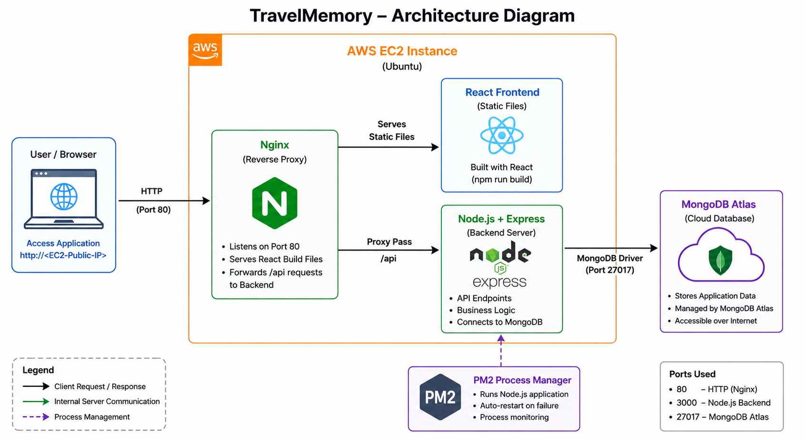

#  TravelMemory – AWS EC2 Deployment

##  Project Overview

This project demonstrates deployment of the **TravelMemory MERN Stack Application** on an AWS EC2 instance.

The application allows users to store and manage travel memories with images and details.

---

##  Tech Stack

- Frontend: React
- Backend: Node.js + Express
- Database: MongoDB Atlas
- Web Server: Nginx
- Hosting: AWS EC2
- Process Manager: PM2

---

##  Architecture Diagram

---

##  Deployment Steps

###  Launch EC2 Instance
- Created Ubuntu EC2 instance on AWS
- Configured security group:
  - Port 22 (SSH)
  - Port 80 (HTTP)

---

### Connect to EC2
ssh -i your-key.pem ubuntu@<EC2_PUBLIC_IP>

### Install Dependencies
sudo apt update && sudo apt upgrade -y
sudo apt install -y nginx git curl
curl -fsSL https://deb.nodesource.com/setup_20.x | sudo -E bash -
sudo apt install -y nodejs
sudo npm install -g pm2

### Clone Repository

git clone https://github.com/UnpredictablePrashant/TravelMemory.git
cd TravelMemory

### Backend Setup

cd backend
npm install

### Create .env file:

MONGO_URI=your_mongodb_atlas_connection_string
PORT=3000

### Start backend using PM2:

pm2 start index.js --name travelmemory-backend
pm2 save

### Update API URL:

// frontend/src/url.js
export const baseUrl = "/api";
export default baseUrl;

### Install and build frontend:

cd frontend
npm install
npm run build

### Configure Nginx

Create Nginx config:

server {
    listen 80;
    server_name _;

    root /home/ubuntu/TravelMemory/frontend/build;
    index index.html;

    location /api/ {
        proxy_pass http://127.0.0.1:3000/;
    }

    location / {
        try_files $uri /index.html;
    }
}

### Enable configuration:

sudo ln -s /etc/nginx/sites-available/travelmemory /etc/nginx/sites-enabled/
sudo rm /etc/nginx/sites-enabled/default
sudo nginx -t
sudo systemctl restart nginx

### Application Access
The application is accessible via: http://<EC2_PUBLIC_IP>

### API Test
curl http://localhost/api/trip

